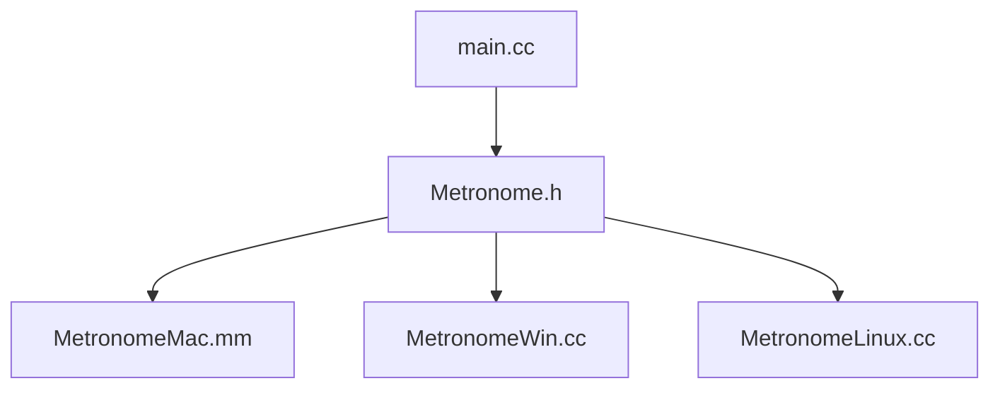

# SimpleMetro

A basic, cross platform CLI metronome. Uses OS-native frameworks to play audio. Mostly meant as an exercise to see what it takes to create a cross-platform application with C++.

## How it works

The program takes **milliseconds** passed since Jan 1, 1970 (a "Unix Timestamp"), and
sets the next click to be at the next multiple of the BPM interval in milliseconds. Example: The BPM is 120, which means the 
BPM interval is 500 milliseconds. If the current Unix Timestamp is 2100 milliseconds, then the next beat is at 2500 milliseconds, since that is the next multiple of 500.

Therefore, if two computers share the same system time, then the metronome click will occur at **exactly the same time** (barring any audio latency).

## Usage

Within your terminal emulator/command prompt:

```<path to metronome executable> <bpm>```

Quit using Ctrl+C.

**Please ensure the `sounds` folder that came with the executable is in the same directory as the executable.**

## Structure



`main.cc`: The cross platform logic of the program. Creates and stores a Metronome instance for playing audio.<br><br>
`Metronome.h`: Defines the Metronome class: the abstraction layer for playing audio. Includes functions `init` and `playClick`.<br><br>
`MetronomeMac.mm`, `MetronomeWin.cc`, `MetronomeLinux.cc`: Platform specific implementations of the Metronome class.


